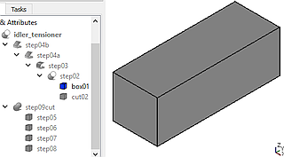
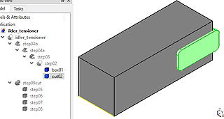
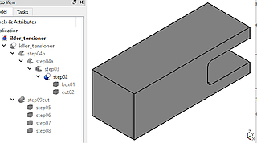
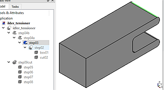
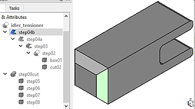
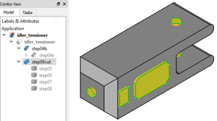
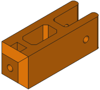

# FreeCAD python scripts detailed steps for the Idler Tensioner


This example is created using python functions defined in the folder src/comps

The source file: [idler_tensioner.py](src/idler_tensioner.py)

The resulting FreeCAD model: [idler_tensioner.FCStd](freecad/idler_tensioner.FCStd)

This tutorial can be compared with the [OpenSCAD tutorial](https://github.com/felipe-m/oscad_filter_stage) for this [Idler Tensioner](https://github.com/felipe-m/oscad_filter_stage/blob/master/idler_tensioner.md) 

With FreeCAD you can navigate through the model:


You may want to check the steps for the [tensioner holder](./tensioner_holder.md), which have been also created using Python scripts, but using other kind of functions

Back to the [readme.md](./readme.md)

# Steps

## Step 00: Libraries import and function creation

```python
import os
import sys
import FreeCAD
import FreeCADGui
import Part

# to get the current directory. Freecad has to be executed from the same
# directory this file is
filepath = os.getcwd()
# to get the components
# In FreeCAD can be added: Preferences->General->Macro->Macro path
sys.path.append(filepath) 
#sys.path.append(filepath + '/' + 'comps')
sys.path.append(filepath + '/../../' + 'comps')

# where the freecad document is going to be saved
savepath = filepath + "/../../freecad/citometro/py/"

import kcomp   # import material constants and other constants
import fcfun   # import my functions for freecad. FreeCad Functions
import comps   # import my CAD components
import partgroup   # import my CAD components
import kidler  # import constants for the idler tensioner and holder


def idler_tens ():
    # bring the active document
    doc = FreeCAD.ActiveDocument
```


## Step 01: Create the box
Everything else will cut the box:

```python
    #  --------------- step 01 ---------------------------      
    #  rectangular cuboid with basic dimensions
    # 
    #           Z
    #           :.....tens_l.......
    #           :_________________:
    #           /                /|
    #          /                / |
    #       ../________________/  |..............Y     .
    #      :  |                |  /     . 
    # tens_h  |                | /     . tens_w
    #       :.|________________|/......
    #        .
    #       .
    #      X 
    #
    # oscad: cube([tens_w, tens_l, tens_h]);

    # creates the shape, you don't see it yet on FreeCAD Gui
    shp01 = fcfun.shp_boxcen(kidler.tens_w, kidler.tens_l, kidler.tens_h)
    # creates a freecad object from the shape, to see it in FreeCAD Gui,
    # not necessary, but illustrative for this tutorial
    fcd01 = fcfun.add_fcobj(shp01, 'box01')

```





## Step 02: Space for the idler pulley

```python
    #  --------------- step 02 ---------------------------  
    # Space for the idler pulley
    #      Z
    #      :
    #      :_______________________
    #      |                 ______|....
    #      |                /          + idler_h
    #      |               |           :
    #      |                \______....:
    #      |_______________________|...wall_thick.......> Y
    #                      :       :
    #                      :.......:
    #                         +
    #                       2 * idler_r_xtr
    #
    # oscad: translate ([-1, tens_l - 2*idler_r_xtr, wall_thick])
    # ...
    pos02 = FreeCAD.Vector(-1,
                           kidler.tens_l - 2*kidler.idler_r_xtr,
                           kidler.wall_thick)
    # oscad: cube([tens_w+2, 2 * idler_r_xtr +1, idler_h]);
    # ...
    # creates the shape already filleted on X, make it larger on Y to make 
    # the chamfer easier, so all X edges are chamfered, but since is larger
    # on Y, it doesnt matter.  y dimensions
    shp02cut = fcfun.shp_boxcenfill(
                     x = kidler.tens_w+2,
                     # in_fillet added
                     y = 2 * kidler.idler_r_xtr +1 + kidler.in_fillet,
                     z = kidler.idler_h,
                     fillrad = kidler.in_fillet,
                     fx = True, fy = False, fz = False, # chamfer on X
                     pos = pos02)
    fcd02cut = fcfun.add_fcobj(shp02cut, 'cut02')
    # difference (cut) of fcd01 and fcd02cut
    fcd02 = doc.addObject("Part::Cut", 'step02')
    fcd02.Base = fcd01
    fcd02.Tool = fcd02cut
    # the shape
    shp02 = fcd02.Shape

    doc.recompute()
```



## Step 03: Fillets at the idler end

```python
    # Fillets at the idler end:

    #      Z
    #      :
    #      :_______________________f2
    #      |                 ______|
    #      |                /      f4
    #      |               |
    #      |                \______f3...
    #      |_______________________|....+ wall_thick.....> Y
    #      :                       f1
    #      :...... tens_l .........:
    #
    fcd03 = fcfun.filletchamfer (fcd02, e_len = kidler.tens_w,
                                name = 'step03',
                                fillet = 1,
                                radius = kidler.in_fillet,
                                axis = 'x',  # axis to fillet
                                ypos_chk = 1,
                                ypos = kidler.tens_l) #fillet on y=tens_l


```



## Step 04: Chamfers at the nut end

```python
    #  --------------- step 04 --------------------------- 
    # Chamfers at the nut end:

    #      Z
    #      :
    #      : ______________________
    #    ch2/                ______|
    #      |                /             
    #      |               |        
    #      |                \______
    #    ch1\______________________|.............> Y
    #      :                       :
    #      :...... tens_l .........:
    # 
    fcd04a = fcfun.filletchamfer (fcd03, e_len = 0,
                                  name = 'step04a',
                                  fillet = 0,  # chamfer
                                  radius = 2* kidler.in_fillet,
                                  axis = 'x',  # axis to fillet
                                  ypos_chk = 1,
                                  ypos = 0) #fillet on y=0

```


## Step 04 Optional: Chamfers at the nut end on axis Z
They are 45 degrees so they should print ok without support, but you may
not want to have them

```python
   #  --------------- step 04b OPTIONAL---------------------- 
   #  Chamfers at the nut end on axis Z, they are 45 degrees
   #  so they should print ok without support, but you may
   #  not want to have them

   #        ________ ....> X
   #    ch1/________\ch2
   #       |        |
   #       |        |
   #       |        |
   #       |        |
   #       |        |
   #       |        |
   #       |........|
   #       |        |
   #       |        |
   #       |        |
   #       |________|
   #       :
   #       Y
   #       
   # 

    if (kidler.opt_tens_chmf == 1) : # optional tensioner chamfer
        fcd04 = fcfun.filletchamfer (fcd04a, e_len = 0,
                                      name = 'step04b',
                                      fillet = 0,  # chamfer
                                      radius = 2* kidler.in_fillet,
                                      axis = 'z',  # axis to fillet
                                      ypos_chk = 1,
                                      ypos = 0) #fillet on y=0
    else:
        # just to have the same freecad object at the end of step 4 in fcd04
        fcd04 = fcd04a 

```




## Step 05: Shank hole for the idler pulley

```python
    #  --------------- step 05 --------------------------- 
    # Shank hole for the idler pulley:

    #      Z                     idler_r_xtr
    #      :                    .+..
    #      : ___________________:__:
    #       /                __:_:_|
    #      |                /             
    #      |               |        
    #      |                \______
    #       \__________________:_:_|.............> Y
    #      :                       :
    #      :...... tens_l .........:
    #                     
    #oscad: translate ([tens_w/2., tens_l - idler_r_xtr, -1])
    #oscad:     cylinder (r=boltidler_r_tol, h= tens_w +2, $fa=1, $fs=0.5);
    pos05 = FreeCAD.Vector(kidler.tens_w/2.,
                           kidler.tens_l - kidler.idler_r_xtr,
                           -1)
    fcd05 = fcfun.addCylPos (r = kidler.boltidler_r_tol,
                             h = kidler.tens_h +2,
                             name = 'step05',
                             pos = pos05)
    # we will make the cut at the end with the other cuts
```

Step05 is the yellow cylinder:


  

## Step 06: Hole for the leadscrew (stroke)

```python
    #  --------------- step 06 --------------------------- 
    # Hole for the leadscrew (stroke):

    #      Z
    #      :
    #      : ______________________
    #       /      _____     __:_:_|
    #      |    f2/     \f4 /             
    #      |     |       | |        
    #      |    f1\_____/f3 \______
    #       \__________________:_:_|.............> Y
    #      :     :       :         :
    #      :     :.......:         :
    #      :     :   +             :
    #      :.....:  tens_stroke    :
    #      :  +                    :
    #      : nut_holder_total      :
    #      :                       :
    #      :...... tens_l .........:
    # 

    #  Space for screw (the stroke)
    #oscad: translate ([-1, nut_holder_total,wall_thick])
    pos06 = FreeCAD.Vector (-1,
                            kidler.nut_holder_total,
                            kidler.wall_thick)
    # shape of a box with fillet in all the X edges
    #oscad: cube([tens_w+2, tens_stroke, idler_h]);
    shp06 = fcfun.shp_boxcenchmf (x = kidler.tens_w+2,
                                  y = kidler.tens_stroke,
                                  z = kidler.idler_h,
                                  chmfrad = kidler.in_fillet,
                                  fx = True,
                                  fz = False,
                                  pos = pos06)
    fcd06 = fcfun.add_fcobj(shp06, 'step06')

```

Step06 is the orange element


  


## Step 07: Hole for the leadscrew shank at the beginning

```python
    #  --------------- step 07 --------------------------- 
    # Hole for the leadscrew shank at the beginning

    #      Z
    #      :
    #      : ______________________
    #       /      _____     __:_:_|
    #      |      /     \   /
    #      |:::::|       | |
    #      |      \_____/   \______
    #       \__________________:_:_|.............> Y
    #      :     :                 :
    #      :     :                 :
    #      :     :                 :
    #      :.....:                 :
    #      :  +                    :
    #      : nut_holder_total      :
    #      :                       :
    #      :...... tens_l .........:
    #                       
    #oscad: translate ([tens_w/2, -1, tens_h/2])
    pos07 = FreeCAD.Vector(kidler.tens_w/2,
                           -1,
                           kidler.tens_h/2)
    #oscad:rotate ([-90,0,0])
    #oscad: cylinder (r=bolttens_r_tol, h=nut_holder_total+2,$fa=1, $fs=0.5);
    fcd07 = fcfun.addCylPos (r = kidler.bolttens_r_tol,
                             h = kidler.nut_holder_total +2.,
                             name = 'step07',
                             normal = fcfun.VY, #on the positive y axis
                             pos = pos07)
```
Step07 is the red cylinder


  


## Step 08: Hole for the leadscrew nut

```python
    #  --------------- step 08 --------------------------- 
    # Hole for the leadscrew nut

    #      Z
    #      :
    #      : ______________________
    #       /      _____     __:_:_|
    #      |  _   /     \   /
    #      |:|_|:|       | |
    #      |      \_____/   \______
    #       \__________________:_:_|.............> Y
    #      : :   :                 :
    #      :+    :                 :
    #      :nut_holder_thick       :
    #      :.....:                 :
    #      :  +                    :
    #      : nut_holder_total      :
    #      :                       :
    #      :...... tens_l .........:
    #                       

    #oscad: tens_w/2-1 to have more tolerance, so it is a little bit deeper
    #oscad: translate ([tens_w/2-1, nut_holder_thick, tens_h/2])
    # dont need to have tens_w/2-1, because there is xtr argument for that
    pos08 = FreeCAD.Vector (kidler.tens_w/2., 
                            kidler.nut_holder_thick,
                            kidler.tens_h/2.)
    #oscad: cylinder (r=m4_nut_r_tol+stol, h = nut_space, $fn=6);
    #oscad:  cube([tens_w/2 + 2, nut_space, 2*m4_nut_ap_tol]);
    shp08 = fcfun.shp_nuthole (nut_r = kidler.bolttens_r_tol + kcomp.STOL,
                               nut_h = kidler.nut_space,
                               hole_h = kidler.tens_w/2,
                               xtr_nut = 1, xtr_hole = 1, 
                               # on the Y direction
                               fc_axis_nut = FreeCAD.Vector(0,1,0),
                               # on the X direction
                               fc_axis_hole = FreeCAD.Vector(1,0,0),
                               ref_nut_ax = 2, # pos not centered on axis nut 
                               # pos at center of nut on axis hole 
                               ref_hole_ax = 1, 
                               pos = pos08)
    fcd08 = fcfun.add_fcobj(shp08, 'step08')
```

Step08 is the green element:


  


## Step 09: Union of all the elements to cut, and final cut
```python
    # --------- step 09:
    # --------- Last step, union and cut of the steps 05, 06, 07, 08
    fcd09cut = doc.addObject("Part::MultiFuse", "step09cut")
    fcd09cut.Shapes = [fcd05,fcd06,fcd07,fcd08]
    fcd09final = doc.addObject("Part::Cut", "idler_tensioner")
    fcd09final.Base = fcd04
    fcd09final.Tool = fcd09cut
    doc.recompute()
    return fcd09final
```



## Step 10: Saving, rotating to print and export:

```python
# creation of a new FreeCAD document
doc = FreeCAD.newDocument()
# creation of the idler tensioner
fcd_idler_tens = idler_tens()
# change color to orange:
fcd_idler_tens.ViewObject.ShapeColor = (1.0, 0.5, 0.0)


# ---------- export to stl
stlPath = filepath + '/../stl/'
stlFileName = stlPath + 'ilder_tensioner' + '.stl'
# rotate to print without support:
fcd_idler_tens.Placement.Rotation = (
                    FreeCAD.Rotation(FreeCAD.Vector(0,1,0), -90))
fcd_idler_tens.Shape.exportStl(stlFileName)

# rotate back
fcd_idler_tens.Placement.Rotation = (
                    FreeCAD.Rotation(FreeCAD.Vector(1,0,0), 0))

# save the FreeCAD file
freecadPath = filepath + '/../freecad/'
freecadFileName = freecadPath + 'ilder_tensioner' + '.FCStd'
doc.saveAs (freecadFileName)
```

Idler tensioner rotated to be exported to stl and print:


