# FreeCAD python scripts detailed steps for the Tensioner Holder


This example is created using FreeCAD python functions and all objects are created using objects in the FreeCAD document.

Check [the FreeCAD scripting basics tutorial](https://www.freecadweb.org/wiki/FreeCAD_Scripting_Basics) for more information

The source file: [tensioner_holder.py](src/tensioner_holder.py)

The resulting FreeCAD model: [tensioner_holder.FCStd](freecad/tensioner_holder.FCStd)

This tutorial can be compared with the [OpenSCAD tutorial](https://github.com/felipe-m/oscad_filter_stage) for this [Tensioner Holder](https://github.com/felipe-m/oscad_filter_stage/blob/master/tensioner_holder.md) 


## Running python scripts

If you run the Python script, make sure to read this tutorial: https://www.freecadweb.org/wiki/Python_scripting_tutorial.

Go to **Edit->Prefences->General->Output window** and check 2 boxes:

- Redirect internal Python output to report view
- Redirect internal Python errors to report view

Then go to **View->Panels** and check:

- Report view

Also, for this script, go to: **Edit->Preferences->PartDesign** to enable automatic checking and refining of the model after Boolean and sketch based operations (performance may be affected if these options are left switched on). 

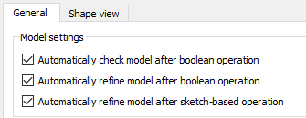

## Python scripting in FreeCAD

Using Python scripts in FreeCAD to make your own CAD models can be done in many different ways.

This example is created using FreeCAD python functions and all objects are created using Objects.

On the other example, functions to create shapes were used:  [idler tensioner](./idler_tensioner.md)

Back to the [readme.md](./readme.md)

## Steps

### Step 00: Libraries import and function creation

```python
import os
import sys
import FreeCAD
import FreeCADGui
import Part

# to get the current directory. Freecad has to be executed from the same
# directory this file is
filepath = os.getcwd()
# to get the components
# In FreeCAD can be added: Preferences->General->Macro->Macro path
sys.path.append(filepath) 
#sys.path.append(filepath + '/' + 'comps')
sys.path.append(filepath + '/../../' + 'comps')

import kcomp   # import material constants and other constants
import fcfun   # import my functions for freecad. FreeCad Functions
import comps   # import my CAD components
import kidler  # import constants for the idler tensioner and holder

# to make a comparision of equality in floats, less than this number
mindif = 0.001

def tensioner_holder():
    # bring the active document
    doc = FreeCAD.ActiveDocument
```


## Step 01: Create the base

```python
    #  --------------- step 01 ---------------------------      
    #    the base, to attach it to the aluminum profiles
    #    
    #
    #                                           Z      Z
    #                                           :      :
    #                 .. _______________________:      :________
    #     hold_bas_h.+..|_______________________|      |________|......Y
    #
    #                    .... hold_bas_w ........
    #                   :                        :
    #            X......:________________________:....
    #                   |                        |    :
    #                   |                        |    + hold_bas_l
    #                   |________________________|....:
    #                                            :
    #                                            Y
    #
    # cube([hold_bas_w, hold_bas_l, hold_bas_h]);
    fcd01 = doc.addObject("Part::Box",'base_box_st01')
    fcd01.Length = kidler.hold_bas_w
    fcd01.Width = kidler.hold_bas_l
    fcd01.Height = kidler.hold_bas_h
```

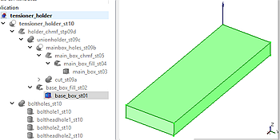


## Step 02: Fillet the base

```python
   #    --------------- step 02 --------------------------- 
    #    Fillet the base
    #    The piece will be printed on the XZ plane, so this fillet will be 
    #    raising
    #  
    #                                         Z
    #                                         :
    #                f4_______________________f2
    #          X......(_______________________)
    #                f3                        f1
    #
    edgefill_list = []
    # for each edge, take the 2 vertexes:
    for edge_ind, edge in enumerate(fcd01.Shape.Edges):
        v0 = edge.Vertexes[0]
        v1 = edge.Vertexes[1]
        # check if this 2 Vertexes have the same X, Z: so they are the Y axis
        # since they are floats, would be better to compare within a range
        #if abs(v0.X-v1.X) < mindif  and abs(v0.Z - v1.Z) < mindif: 
        if v0.X == v1.X and v0.Z == v1.Z: 
            edgefill_list.append((edge_ind+1, # numbered starting in 1
                                  kidler.in_fillet, kidler.in_fillet))
    fcd02 = doc.addObject ("Part::Fillet", 'base_box_fill_st02')
    fcd02.Base = fcd01
    fcd02.Edges = edgefill_list
    # It is recomended to recompute after fillet/chamfer and other operations
    doc.recompute()
    # hide the step 01:
    fcd01.ViewObject.Visibility = False
```
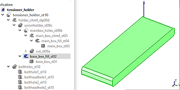

## Step 03: The main box

```python
    #    --------------- step 03 --------------------------- 
    #    The main box
    #                             aluprof_w   Z      Z
    #                                  ..+....:      :
    #           .............. _______:       :      :____________
    #           :             |       |       :      |            |
    #           :             |       |       :      |            |
    #   hold_h +:             |       |       :      |            |
    #           :             |       |       :      |            |     
    #           :      _______|       |_______:      |________    |
    #       X...:.....(_______|_______|_______)      |________|___|...Y
    #                                                :            :
    #                  .... hold_bas_w ........      :.. hold_l...:
    #                 :                        :
    #                 :        .hold_w.        :
    #                 :       :       :        :
    #          X......:_______:_______:________:....
    #                 |       |       |        |    :
    #                 |       |       |        |    + hold_bas_l
    #                 |_______|       |________|....:
    #                         |       |        :
    #                         |_______|        :
    #                                          :
    #                                          :
    #                                          Y
    #oscad: translate ([aluprof_w,0,0])
    #oscad    cube([hold_w, hold_l, hold_h]);
    fcd03 = doc.addObject("Part::Box",'main_box_st03')
    fcd03.Length = kidler.hold_w
    fcd03.Width = kidler.hold_l
    fcd03.Height = kidler.hold_h
    fcd03.Placement.Base = FreeCAD.Vector(kidler.aluprof_w, 0,0)

```
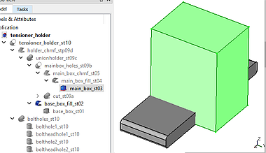


## Step 04: Fillets on top

```python
    #    --------------- step 04 --------------------------- 
    #    Fillets on top
    #                             aluprof_w   Z
    #                                  ..+....:
    #           .............f2_______f1      : 
    #           :             /       \       :
    #           :             |       |       :
    #   hold_h +:             |       |       :
    #           :             |       |       :
    #           :      _______|       |_______:
    #       X...:.....(_______|_______|_______)
    #
    edgefill_list = []
    # for each edge, take the 2 vertexes:
    for edge_ind, edge in enumerate(fcd03.Shape.Edges):
        v0 = edge.Vertexes[0]
        v1 = edge.Vertexes[1]
        # check if this 2 Vertexes have the same Z and is equal to hold_h
        # and their X are the same
        # again, better to use range differences: 
        if (abs(v0.Z-kidler.hold_h) < mindif and
            abs(v1.Z-kidler.hold_h) < mindif and 
            abs(v0.X - v1.X) < mindif) : 
        #if (v0.Z == kidler.hold_h and
        #    v1.Z == kidler.hold_h and
        #    v0.X == v1.X) : 
            edgefill_list.append((edge_ind+1, # numbered starting in 1
                                  kidler.in_fillet, kidler.in_fillet))
    fcd04 = doc.addObject ("Part::Fillet", 'main_box_fill_st04')
    fcd04.Base = fcd03
    fcd04.Edges = edgefill_list
    doc.recompute()
    # hide the step 03:
    fcd03.ViewObject.Visibility = False
```
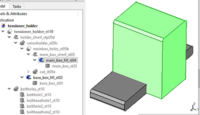

## Step 05: Large chamfer at the bottom

```python
   #    --------------- step 05 --------------------------- 
    #    large chamfer at the bottom

    #                                         Z      Z
    #                                         :      :
    #   Option A               _______        :      :____________
    #                         /       \       :      |            |
    #                         |       |       :      |            |
    #                         |_______|       :      |            |
    #                         |       |       :      |           /       
    #                  _______|_______|_______:      |________ /  
    #       X.........(_______________________)      |________|.......Y
    #                                                :            :

    #   
    #                                         Z      Z
    #                                         :      :
    #   Option B               _______        :      :____________
    #                         /       \       :      |            |
    #                         |       |       :      |            |
    #                         |       |       :      |            |
    #                         |_______|       :      |            |      
    #                  _______|       |_______:      |________   /  
    #       X.........(_______|_______|_______)      |________|/......Y
    #                                                :            :
    #                                                               
    edgechmf_list = []
    # option B: using more material (probably sturdier)
    chmf_rad = min(kidler.hold_l - kidler.hold_bas_l,
                   kidler.hold_h - (kidler.tens_h+2*kidler.wall_thick))
    # option A: using less material
    chmf_rad = min(kidler.hold_l-kidler.hold_bas_l+ kidler.hold_bas_h,
                   kidler.hold_h - (kidler.tens_h+2*kidler.wall_thick))
    for edge_ind, edge in enumerate(fcd04.Shape.Edges):
        v0 = edge.Vertexes[0]
        v1 = edge.Vertexes[1]
        # check if this 2 Vertexes have the same Z and is equal to 0
        # and same Y, and equal to hold_l
        # again, better to use range differences: 
        if (abs(v0.Z) < mindif and
            abs(v1.Z) < mindif and 
            abs(v0.Y - kidler.hold_l) < mindif and
            abs(v1.Y - kidler.hold_l) < mindif ):
            edgechmf_list.append((edge_ind+1, # numbered starting in 1
                                  chmf_rad, chmf_rad))
            break # there is only one
    fcd05 = doc.addObject ("Part::Chamfer", 'main_box_chmf_st05')
    fcd05.Base = fcd04
    fcd05.Edges = edgechmf_list
    doc.recompute()
    # hide the step 04:
    fcd04.ViewObject.Visibility = False
```

Option A:


## Step 06: Hole for the tensioner

```python
    #    --------------- step 06 --------------------------- 
    #    Hole for the tensioner
    #                                         Z      Z
    #                                         :      :
    #                          _______        :      :____________
    #                         /  ___  \       :      |c2..........|
    #                         | |   | |       :      | :          |
    #                         | |___| |       :      |c1..........|
    #                         |_______|       :      |            |      
    #                  _______|       |_______:      |________   /  
    #       X.........(_______|_______|_______)      |________|/......Y

    #
    #oscad:translate([wall_thick-tol/2, hold_l-tens_l_inside,tens_pos_h-tol/2])
    #  oscad: cube([tens_w_tol, tens_l_inside+1, tens_h_tol]);
    fcd06 = doc.addObject("Part::Box",'tens_hole_st06')
    fcd06.Length = kidler.tens_w_tol
    fcd06.Width = kidler.tens_l_inside+1
    fcd06.Height = kidler.tens_h_tol
    fcd06.Placement.Base = (  fcd03.Placement.Base 
                            + FreeCAD.Vector(kidler.wall_thick-kcomp.TOL/2.,
                                             kidler.hold_l-kidler.tens_l_inside,
                                             kidler.tens_pos_h--kcomp.TOL/2.))

    # chamfer:
    edgechmf_list = []
    for edge_ind, edge in enumerate(fcd06.Shape.Edges):
        v0 = edge.Vertexes[0]
        v1 = edge.Vertexes[1]
        # check if these 2 Vertexes have Y = 0 (optional chamfers)
        # and if Z are equal we only select the 2 edges (not the optional)
        if (abs(v0.Y -fcd06.Placement.Base.y) < mindif and
            abs(v1.Y -fcd06.Placement.Base.y) < mindif) :
            if (abs(v0.Z -v1.Z) < mindif  or
                kidler.opt_tens_chmf == 1):
                edgechmf_list.append((edge_ind+1, # numbered starting in 1
                                      2*kidler.in_fillet-kcomp.TOL,
                                      2*kidler.in_fillet-kcomp.TOL))
    fcd06chmf = doc.addObject ("Part::Chamfer", 'tens_hole_chmf_st06')
    fcd06chmf.Base = fcd06
    fcd06chmf.Edges = edgechmf_list
    doc.recompute()
    # hide the step 06:
    fcd06.ViewObject.Visibility = False
    fcd06chmf.ViewObject.ShapeColor = (1., 1., 0.) # YELLOW
```

Including optional chamfers:

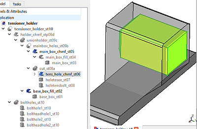
  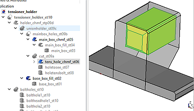

## Step 07: A hole to be able to see inside, could be on one side or both

```python
    #    A hole to be able to see inside, could be on one side or both
    #                                         Z      Z
    #                                         :      :
    #                          _______        :      :____________
    #                         /. ___ .\       :      |  ._______ .|
    #                         |.|   |.|       :      | :|_______| |
    #                         | |___| |       :      |  ..........|
    #                         |_______|       :      |            |      
    #                  _______|       |_______:      |________   /  
    #       X.........(_______|_______|_______)      |________|/......Y

    fcd07 = doc.addObject("Part::Box",'holetosee_st07')
    if kidler.hold_hole_2sides == 1:
        fcd07.Length = kidler.hold_w+2
        fcd07_pos_x = -1
    else:
        fcd07.Length = kidler.wall_thick+2
        fcd07_pos_x =  kidler.hold_w - kidler.wall_thick-1 
    fcd07.Width = kidler.hold_l - kidler.nut_holder_thick - 2* kidler.wall_thick
    fcd07.Height = 2* kidler.tensnut_ap_tol

    # The placement will be the sum of these 2 vectors:
    #   1. placement of the main box
    #   2. relative position inside the main box
    fcd07.Placement.Base = (  fcd03.Placement.Base # main box
                            + FreeCAD.Vector(
                                   fcd07_pos_x,
                                   kidler.wall_thick + kidler.nut_holder_thick,
                                   kidler.tens_pos_h +  kidler.tens_h /2
                                     - kidler.tensnut_ap_tol)) 
    fcd07.ViewObject.ShapeColor = (0., 1., 0.) # GREEN

```

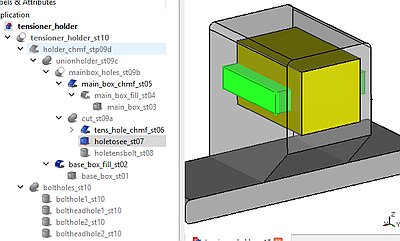
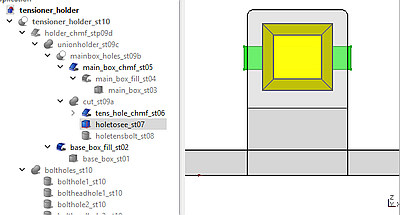


## Step 08: Hole for the leadscrew

```python
    #    A hole for the leadscrew
    #                                         Z      Z
    #                                         :      :
    #                          _______        :      :____________
    #                         /. ___ .\       :      |  ._______ .|
    #                         |.| O |.|       :      |::|_______| |
    #                         | |___| |       :      |  ..........|
    #                         |_______|       :      |            |      
    #                  _______|       |_______:      |________   /  
    #       X.........(_______|_______|_______)      |________|/......Y
    #
    #oscad: translate ([hold_w/2, -1, tens_pos_h + tens_h/2])
    #oscad:  rotate ([-90,0,0])
    #oscad:   cylinder (r=bolttens_r_tol, h=wall_thick+2, $fa=1, $fs=0.5); 
    fcd08 =  doc.addObject("Part::Cylinder",'holetensbolt_st08')
    fcd08.Radius = kidler.bolttens_r_tol
    fcd08.Height = kidler.wall_thick + 2.
    fcd08.Placement.Base = (  fcd03.Placement.Base #main box
                            + FreeCAD.Vector(
                                    kidler.hold_w/2.,
                                    -1, 
                                    kidler.tens_pos_h + kidler.tens_h/2.))
    fcd08.Placement.Rotation = FreeCAD.Rotation(FreeCAD.Vector(1,0,0),-90)
    fcd08.ViewObject.ShapeColor = (1., 0., 0.) # RED
```

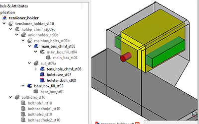
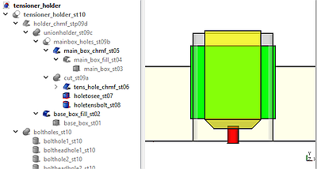

Final hole:

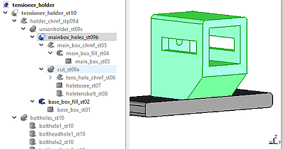


## Step 09: Fuse with the base and chamfer the unions:

```python
    #    --------------- step 09 --------------------------- 
    #    09a: Fuse all the elements to cut
    #    09b: Cut the box with the elements to cut
    #    09c: Fuse the base with the holder
    #    09d: chamfer the union
    #                             Z   Z
    #                             :   :
    #              _______        :   :____________
    #             /. ___ .\       :   |  ._______ .|
    #             |.| O |.|       :   |::|_______| |...
    #            /| |___| |\      :   |  ..........|... tens_h/2 -tensnut_ap_tol
    #           / |_______| \     :   |            |  :+tens_pos_h
    #      ____/__|       |__\____:   |________   /   :  ...
    #  X..(_______|_______|_______)   |________|/.....:.....hold_bas_h
    #
    fcd09a = doc.addObject("Part::MultiFuse", 'cut_st09a')
    fcd09a.Shapes = [fcd06chmf, fcd07, fcd08]

    fcd09b = doc.addObject("Part::Cut", 'mainbox_holes_st09b')
    fcd09b.Base = fcd05
    fcd09b.Tool = fcd09a

    fcd09c = doc.addObject("Part::Fuse", 'unionholder_st09c')
    fcd09c.Base = fcd09b
    fcd09c.Tool = fcd02 #the base
    doc.recompute()

    # chamfer the union 09d
    chmf_rad = min(kidler.aluprof_w/2,
                   kidler.tens_pos_h + kidler.tens_h/2
                   - kidler.tensnut_ap_tol - kidler.hold_bas_h);
    edgechmf_list = []
    for edge_ind, edge in enumerate(fcd09c.Shape.Edges):
        if len(edge.Vertexes) == 2: #not all the edges have 2 vertexes
            v0 = edge.Vertexes[0]
            v1 = edge.Vertexes[1]
            # check if these 2 Vertexes have Z = kidler.hold_bas_h
            # and if the X is either aluprof_w or aluprof_w + hold_w
            if ( abs(v0.Z -kidler.hold_bas_h) < mindif and
                 abs(v1.Z -kidler.hold_bas_h) < mindif and
                ((( abs(v0.X -kidler.aluprof_w) < mindif) and
                  ( abs(v1.X -kidler.aluprof_w) < mindif)) or
                 (( abs(v0.X -(kidler.aluprof_w+kidler.hold_w)) < mindif) and
                  ( abs(v1.X -(kidler.aluprof_w+kidler.hold_w)) < mindif)))):
                edgechmf_list.append((edge_ind+1, chmf_rad, chmf_rad))
    fcd09d = doc.addObject ("Part::Chamfer", 'holder_chmf_stp09d')
    fcd09d.Base = fcd09c
    fcd09d.Edges = edgechmf_list
    doc.recompute()
    # hide the step 09c:
    fcd09c.ViewObject.Visibility = False
```

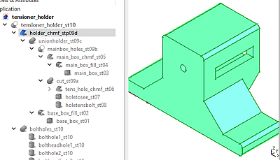  
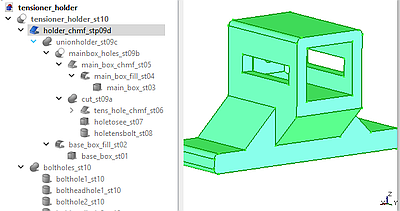


## Step 10: Bolt holes to attach the piece to the aluminum profile
```python
   #    --------------- step 10 --------------------------- 
    #    Bolt holes to attach the piece to the aluminum profile
    #                              Z   Z
    #                              :   :
    #               _______        :   :____________
    #              /. ___ .\       :   |  ._______ .|
    #              |.| O |.|       :   |::|_______| |
    #             /| |___| |\      :   |  ..........|
    #            / |_______| \     :   |            |
    #       ____/__|       |__\____:   |________   /
    #   X..(__::___|_______|__::___)   |___::___|/
    #
    fcd10_shank1 =  doc.addObject("Part::Cylinder",'bolthole1_st10')
    fcd10_shank1.Radius = kidler.aluprof_bolt_r_tol
    fcd10_shank1.Height = kidler.hold_bas_h + 2.
    fcd10_shank1.Placement.Base = FreeCAD.Vector(kidler.aluprof_w/2.,
                                                 kidler.aluprof_w/2.,
                                                 -1) 
    fcd10_head1 =  doc.addObject("Part::Cylinder",'boltheadhole1_st10')
    fcd10_head1.Radius = kidler.aluprof_bolt_head_r_tol
    fcd10_head1.Height = kidler.aluprof_bolt_head_l
    fcd10_head1.Placement.Base = FreeCAD.Vector(kidler.aluprof_w/2.,
                                                kidler.aluprof_w/2.,
                                                kidler.hold_bas_h) 
    fcd10_shank2 =  doc.addObject("Part::Cylinder",'bolthole2_st10')
    fcd10_shank2.Radius = kidler.aluprof_bolt_r_tol
    fcd10_shank2.Height = kidler.hold_bas_h + 2.
    fcd10_shank2.Placement.Base = FreeCAD.Vector(
                                        kidler.hold_bas_w-kidler.aluprof_w/2.,
                                        kidler.aluprof_w/2.,
                                        -1) 
    fcd10_head2 =  doc.addObject("Part::Cylinder",'boltheadhole2_st10')
    fcd10_head2.Radius = kidler.aluprof_bolt_head_r_tol
    fcd10_head2.Height = kidler.aluprof_bolt_head_l
    fcd10_head2.Placement.Base = FreeCAD.Vector(
                                        kidler.hold_bas_w-kidler.aluprof_w/2.,
                                        kidler.aluprof_w/2.,
                                        kidler.hold_bas_h) 
    # fusion of all the bolts and heads
    fcd10_bholes = doc.addObject("Part::MultiFuse", 'boltholes_st10')
    fcd10_bholes.Shapes = [fcd10_shank1, fcd10_head1, fcd10_shank2, fcd10_head2]
    doc.recompute()
    # change color to light orange:
    fcd10_bholes.ViewObject.ShapeColor = (1., 0.5, 0.0)

    fcd10_final = doc.addObject("Part::Cut", 'tensioner_holder_st10')
    fcd10_final.Base = fcd09d # the holder (without the profile bolt holes)
    fcd10_final.Tool = fcd10_bholes # bolt holes
    doc.recompute()
    return fcd10_final

```
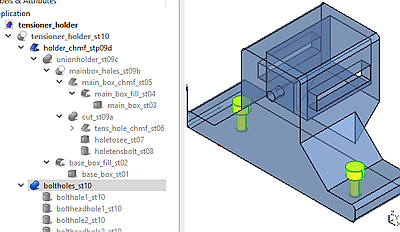   
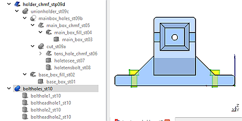

Final cut:

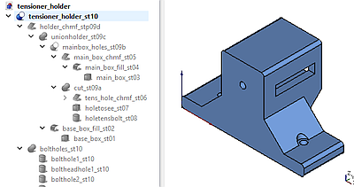


## Step 11: Saving, rotating to print and export:

```python

# creation of a new FreeCAD document
doc = FreeCAD.newDocument()
# creation of the tensioner holder
fcd_tens_holder = tensioner_holder()
# change color to light sky blue:
fcd_tens_holder.ViewObject.ShapeColor = (0.5, 0.7, 1.0)

# ---------- export to stl
stlPath = filepath + '/../stl/'
stlFileName = stlPath + 'tensioner_holder' + '.stl'
# rotate to print without support:
fcd_tens_holder.Placement.Rotation = (
                    FreeCAD.Rotation(FreeCAD.Vector(1,0,0), 90))
fcd_tens_holder.Shape.exportStl(stlFileName)

# rotate back, to see it in its real position
fcd_tens_holder.Placement.Rotation = (
                    FreeCAD.Rotation(FreeCAD.Vector(1,0,0), 0))

# save the FreeCAD file
freecadPath = filepath + '/../freecad/'
freecadFileName = freecadPath + 'tensioner_holder' + '.FCStd'
doc.saveAs (freecadFileName)

```

Tensioner holder rotated to be exported to stl and print:


